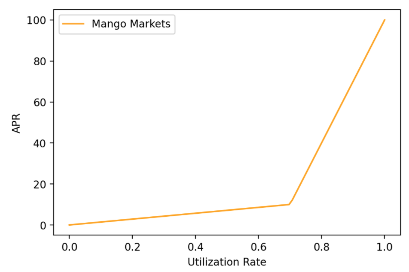

# Asset Specs

### Spot Market Leverage

Note: The asset\_weight applies a haircut to the value of the collateral in health calculations.  The lower the asset weight, the less the asset counts towards collateral. Initial Leverage and Maintenance Leverage can be converted to the corresponding asset\_weights with these calculations:

```text
init_asset_weight = 1 - 1 / init_leverage
init_liab_weight = 1 + 1 / init_leverage
maint_asset_Weight = 1 - 1 / maint_leverage
maint_liab_weight = 1 + 1 / maint_leverage
```

| Token | Initial Leverage | Maintenance Leverage | Liquidation Fee \(%\) |
| :--- | :--- | :--- | :--- |
| BTC | 5 | 10 | 5.00 |
| ETH | 5 | 10 | 5.00 |
| SOL | 5 | 10 | 5.00 |
| SRM | 5 | 10 | 5.00 |
| MNGO | 1.25 | 2.5 | 20.0 |
| USDT | 10 | 20 | 2.5 |

### Asset Interest Rates

The lending pools work similar to the lending pools on Aave. With the big difference that users will earn interest on both their deposits as well as their positions \(so you may be earning net interest on your margin position!\). The interest rate is a function of the utilization ratio: total borrowed by all users divided by total deposits of all users. The interest rate will increase slowly approaching the utilization ratio but will increase rapidly above that to encourage the market to deposit more funds.

| Asset | Optimal Rate | Max Rate | Optimal Utilization |
| :--- | :--- | :--- | :--- |
| BTC | 3.5% | 87.5% | 70% |
| ETH | 2.5% | 62.5% | 70% |
| SOL | 2.5% | 62.5% | 70% |
| SRM | 10% | 250% | 70% |
| MNGO | 6% | 150% | 70% |
| USDT | 5% | 125% | 70% |



