# Trading on Mango Markets

Mango Markets offers an approachable, powerful platform. Trade up to 5x leverage, long or short, with limit or market orders. Mango users save substantially on Serum DEX trading fees**,** more info below under [Fee Discounts](trade-on-mango.markets.md#how-to-view-fee-discounts-contribute-srm). 

## **Connecting to Mango Markets and Depositing Funds**

First, connect your sollet.io wallet by selecting ‘Connect wallet’ in the top right of the Trade view.

* For help creating or funding a Sollet.io wallet, please see [our dedicated article](transfer-funds-to-sollet-wallet.md#how-to-create-a-sollet-io-wallet).

Next, confirm the connection in sollet.io pop-up window.

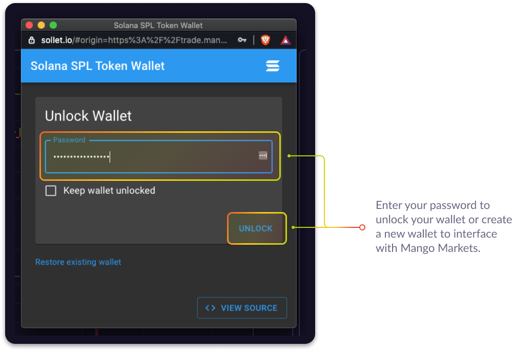

We are working closely with Sollet.io to utilize auto-approval of transactions, however, this feature is not yet functional and all transactions including deposits, trades, settlements, and withdrawals must be approved manually. 

On Mango, although your wallet is connected, funds must be deposited into your Margin Account to be accessed on the platform. Click ‘Deposit’ to add BTC, ETH, SOL, SRM, or USDC to your Margin Account.

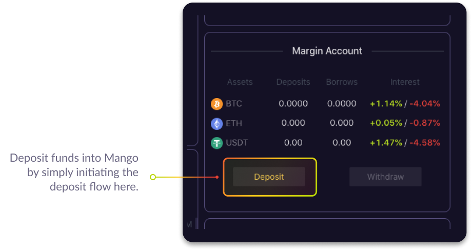

In the deposit window, first choose the currency you want to fund your Margin account with. The wallet address is automatically populated once the currency is selected in the drop-down. Next, enter the amount you wish to move into your Margin account. You’ll need a little SOL in your wallet to cover the transaction fees. 

**All deposits on Mango earn interest; rates can be found in green next to the assets in the "Margin Account" module.**

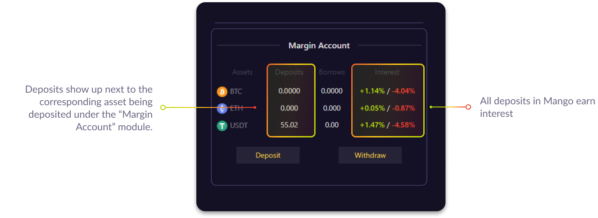

## **How to Make a Trade**

To trade, select your desired asset pair from the menu bar. 

Choose between Buy or Sell and provide trade details: size, price, and order type. To place an order, click the big Buy or Sell asset button at the bottom of the trading box. Note the options of POST and IOC. When IOC \(Immediate or Cancel\) is selected, if an order is placed and not filled within seconds, it's canceled. When POST is selected, limit orders are added to the order-book and earn maker fees if filled. POST orders will always be the 'maker'.

 Limit orders open an order at a set price. If the price of an asset in the orderbook reaches that price, the order will get filled. Market orders will buy or sell the asset immediately at the next price in the orderbook. 

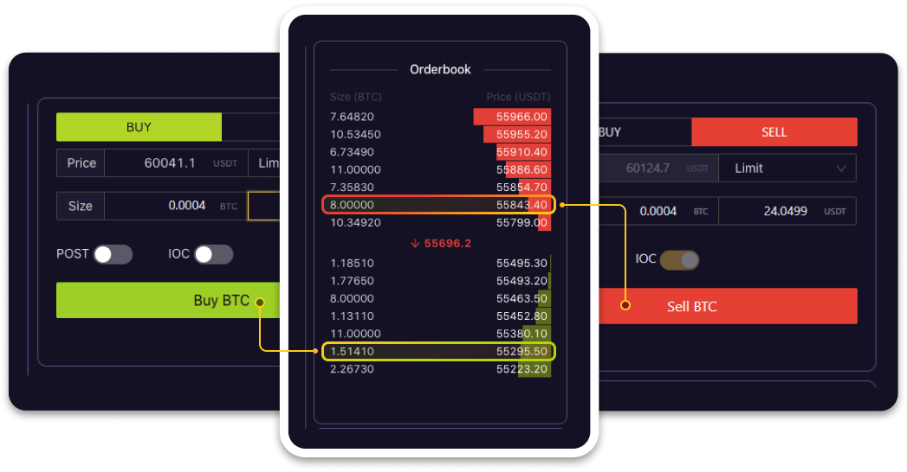

If a taker order is filled, assets will appear in the deposits of your margin account. 

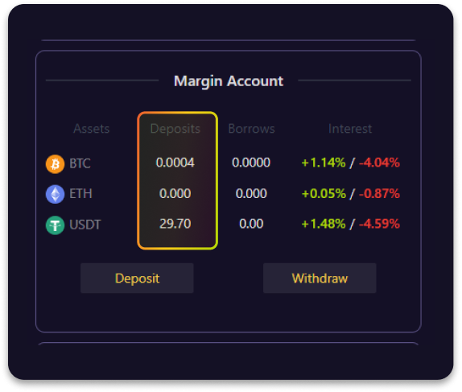

If a maker order is filled, funds must be settled before appearing in your deposits. Visit the 'Balances' tab and click 'Settle'. Only assets included in the selected trading pair will appear here. 

  
View ‘Open Orders’ to manage your open orders at any time. 

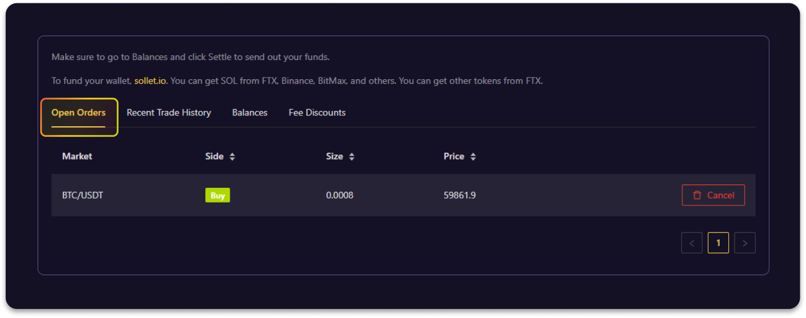

## **How to Trade with Leverage**

To make a leveraged trade, place an order with a size greater than your deposit value; funds are automatically borrowed and appear in the ‘Borrows’ section of your Margin Account. Interest is accumulated and deducted continuously. Rates are on an annual basis and can be found in red next to the asset. The maximum leverage allowance is 5x. 

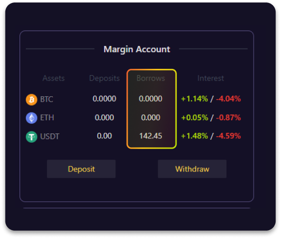

To open a leveraged position, an Initial Collateral Ratio of 120% must be met. Collateral Ratio is the value of the user's deposits and positions divided by the value of their loans. 

Once a position is opened, it must maintain a Maintenance Collateral Ratio above 110%. If an account falls below 110% it will be liquidated and funds lost. To increase collateral ratio, reduce borrows or deposit funds into your margin account.   
  
The current collateral ratio is displayed beneath your Margin Account. 

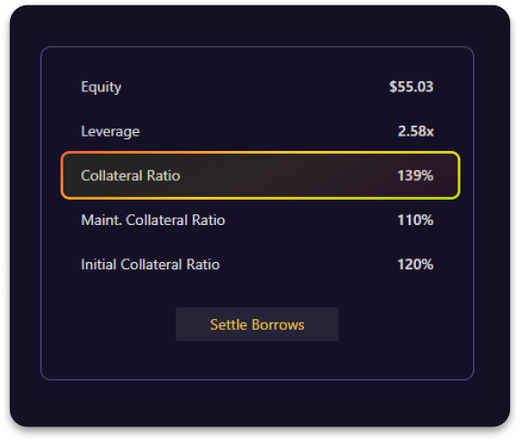

To close a leveraged position, you must settle your borrows. To do this, your deposits must equal or surpass borrows for an asset. To increase deposits, trade for or deposit the asset. Once deposit requirements are met, click ‘Settle Borrows’ and your loans will be repaid. 

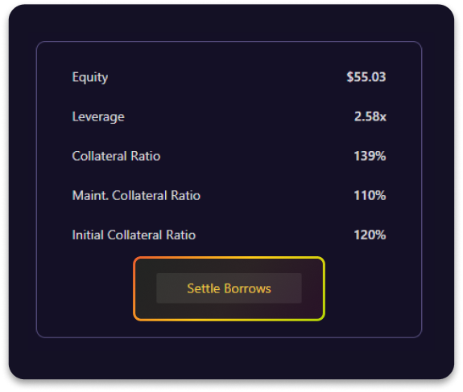

## **How to Withdraw Funds**

Funds can be withdrawn at any time; simply click ‘Withdraw’ in your Margin Account. 

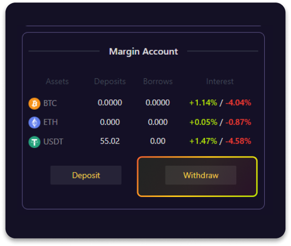

In the Withdraw window, choose your desired asset and select the corresponding wallet address from the drop down. If the message ‘No wallet address found for \[asset\]’ appears, please make sure the token is added to your Sollet.io. 

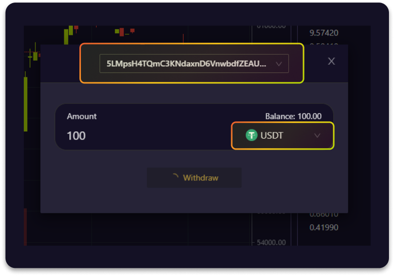

## **How to view Fee Discounts, Contribute SRM** 

Mango traders save substantially on Serum DEX trading fees. Serum's tier structure determines fee rates based on the amount of SRM held in an account; the more SRM in an account, the less you pay in fees and the more you earn as a maker. The highest tier is 1 MegaSerum\(MSRM\), worth 1 million SRM, and unrealistic for most people to obtain. Luckily, Mango margin accounts are structured such that SRM deposits are combined with all users to collectively reach a higher tier and benefit together when trading on the platform.   
  
In V2 Mango with SOL, SRM, and USDC trading, SRM deposits are counted as collateral and toward community fee tier. In V1 Mango\( usdt.mango.markts - BTC/ETH/USDT\) SRM deposits are exempt from liquidation and not counted toward margin collateral. SRM can withdrawn from V1 in the 'Fee Discounts' tab.

Visit 'Fee Discounts'  to view current fee tier.

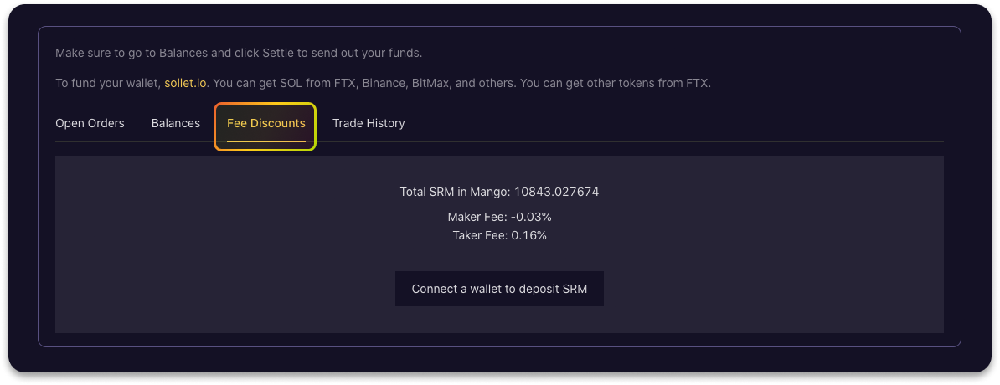

## **How to Withdraw Borrowed Funds**

It is possible to withdraw borrowed funds on Mango Markets.

Ensure assets are [deposited into your margin account](https://app.gitbook.com/@blockworksfoundation/s/mango/~/drafts/-MZPLylXCNfAFWlrfxMI/tutorials/trade-on-mango.markets#connecting-to-mango-markets-and-depositing-funds) for use as collateral. Prior to withdrawing from the platform, assets must be [added to your wallet](https://app.gitbook.com/@blockworksfoundation/s/mango/~/drafts/-MZPLylXCNfAFWlrfxMI/tutorials/transfer-funds-to-sollet-wallet#how-to-add-funds-to-a-sollet-io-wallet). 

Click 'Withdraw' in your margin account, select the asset you wish to withdraw and borrow, and toggle 'Borrow Funds' on. 

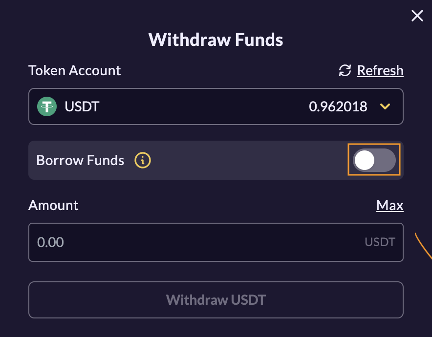

Next, determine the amount you'd like to withdraw. Remember, borrowing funds affects your [collateral ratio](https://app.gitbook.com/@blockworksfoundation/s/mango/~/drafts/-MZPLylXCNfAFWlrfxMI/tutorials/trade-on-mango.markets#how-to-trade-with-leverage) and leverage calculation. If you'd like to withdraw the maximum amount with collateral ratio above maintenance margin threshold, click 'Max with borrow'. An estimated leverage post-withdraw is displayed. 

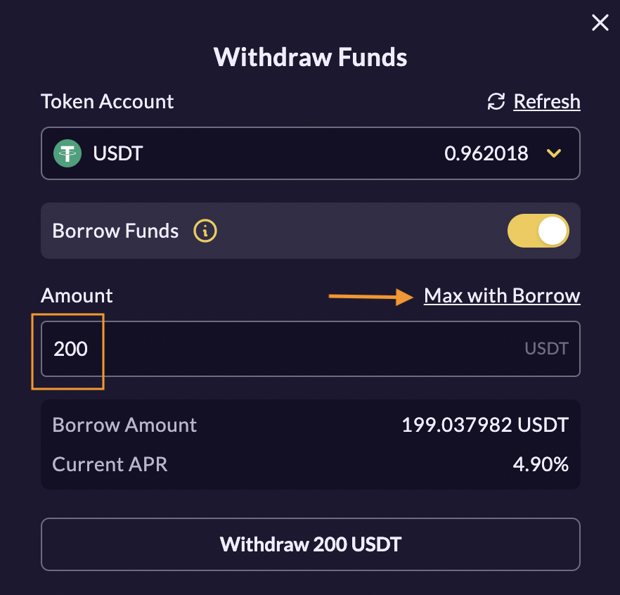

The 'Borrow Amount' displayed below the input is what will be sent to your wallet. This number is less than the input to avoid rounding errors, there are no additional fees and excess funds remain in your margin account. 'Current APR' displays the current interest annual percentage rate on the borrowed asset. 

Click 'Withdraw' and approve transaction from your wallet to complete.

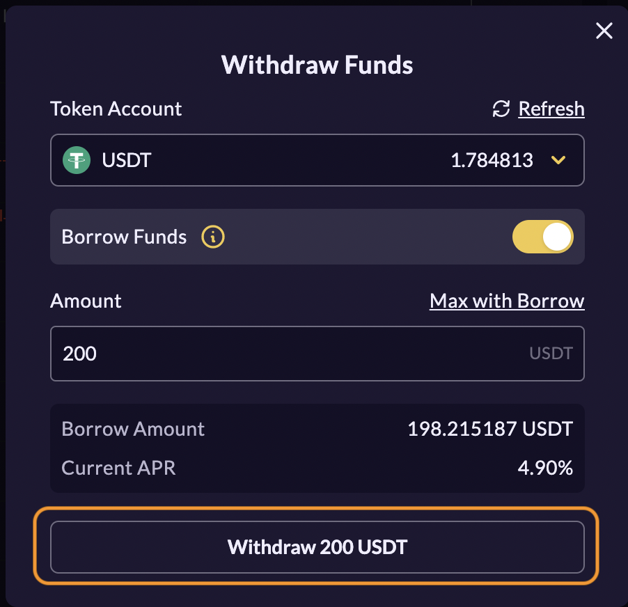

Alternatively, funds can be borrowed in the 'Borrow' Tab 

Click 'Borrow' for the asset you'd like to borrow from the available list.

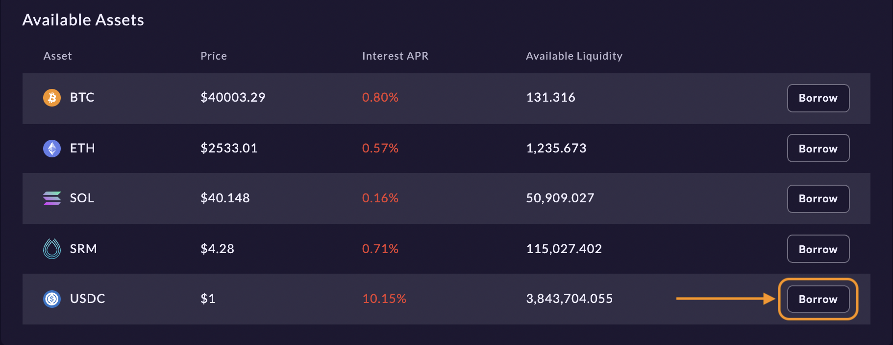

 Enter the amount you wish to borrow; notice your estimated leverage post-withdraw. The 'Max' button will borrow the maximum while maintaining a MCR above 120% . Click 'Next', to view the confirmation panel. 

Interest is paid on your borrows continuously from your deposits. Please monitor interest rates as they recalculate based on pool utilization. 

To repay your loan, deposit or trade for the borrowed asset. 

## **Video Tutorial** 

This comprehensive video tutorial created by CryptoData covers everything from creating and funding your sollet wallet to trading and lending on Mango Markets exchange.



## **Join the community**

The Mango team is committed to providing a fully decentralized, open source, leveraged trading platform capable of matching a centralized-exchange feel with all the unique benefits of DeFi. We are excited to launch Mango Markets and continue bringing new leveraged trading products to life in decentralized form. Visit us at [mango.markets](https://mango.markets/?utm_source=medium&utm_medium=social&utm_campaign=launch_post) to trade and lend.

Follow Mango Markets on Twitter and join the Discord for the latest updates.

twitter:[ https://twitter.com/mangomarkets](https://twitter.com/mangomarkets)

discord: [https://discord.gg/YpzUSTwd](https://discord.gg/P7TzZS9g)

##      

  
  
  
  
  

